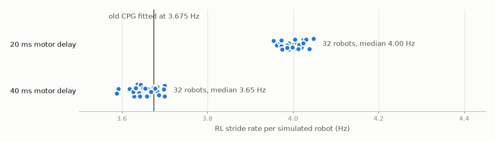
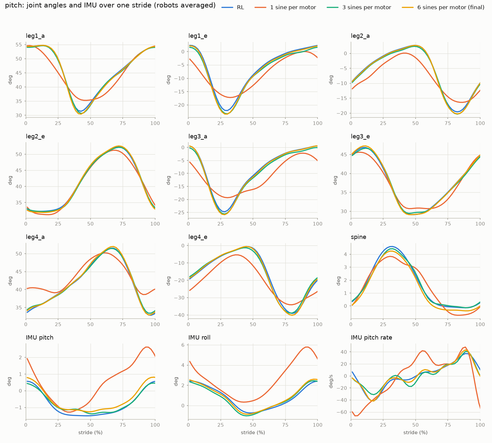
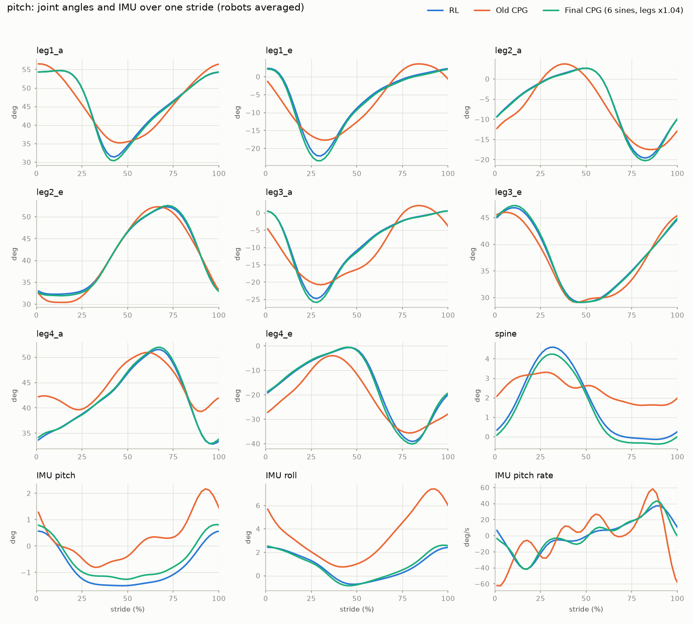
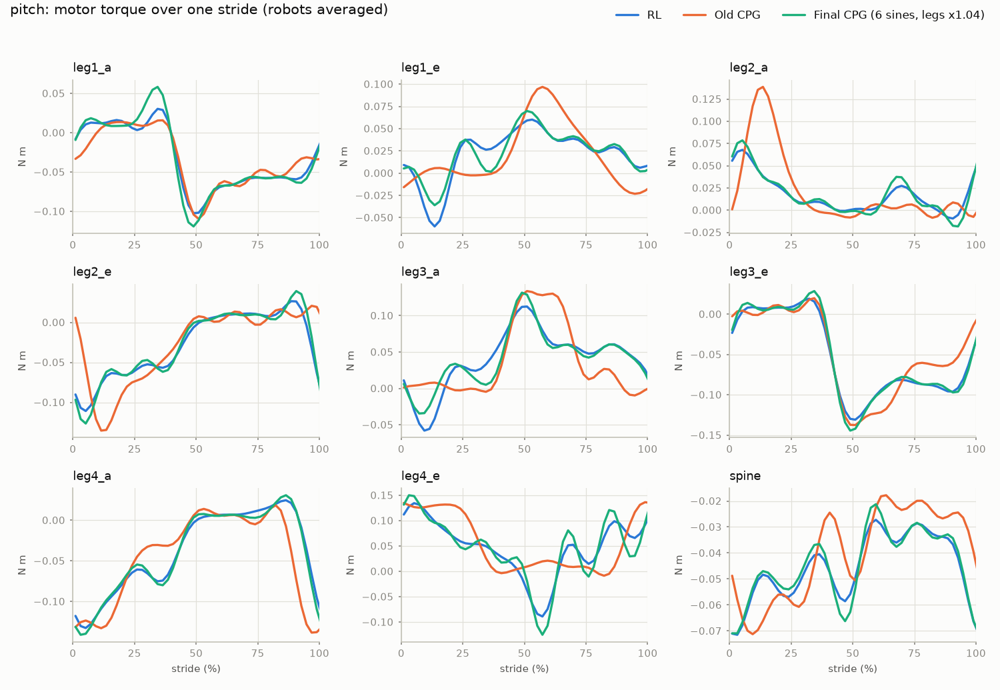
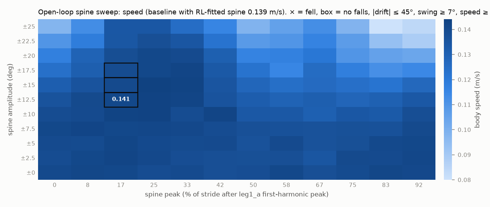
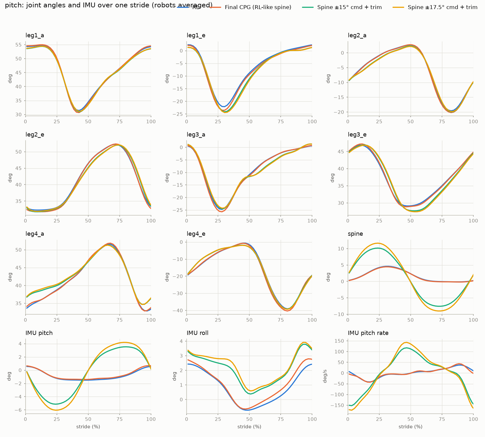

# Pitch CPG fix (2026-09-16)

**Final gait: [`gait_pitch_final.json`](gait_pitch_final.json).** It is an open-loop sine-wave gait (CPG) for the **active-pitch**
Microtaur that reproduces the *average stride* of the flat-ground RL policy (`old_distilling/pitch_all_motors_fixed_v1/model_4499.pt`)
in simulation:

- **leg angles 1.00, spine 0.97–1.00, IMU 0.92–0.95, gyro 0.92–0.96, torque 0.92–0.93** (R², 1 = identical);
- the same body speed (0.146 vs 0.144–0.145 m/s) and no falls, including the board's start sequence.

Each motor is an offset plus 6 sine waves on one 4.00 Hz clock, with no network and no sensors. The same file drives the simulation,
the plots and the board player ([`../board/open_loop_cpg_9dof.py`](../board/open_loop_cpg_9dof.py)); both clip leg commands to stand ±30°.

Overview of all four robots: [`../README.md`](../README.md). All plots and the combined video: [`../results/`](../results/).

Conditions: simulation (MuJoCo / mjlab), flat ground, command 0.15 m/s straight, XL330 motor model, 32 simulated robots per run.

## What was wrong, and what fixed it

| Problem | What the data showed | Fix | Result |
|---|---|---|---|
| **Shape** (main cause) | The RL's leg stroke is a sawtooth: a slow sweep for about two-thirds of the stride, then a fast snap back. One sine per motor is 50/50. It gets the leg angles to 0.84, but the body moves differently (IMU −3.1). | Several sine terms per motor at 1×, 2×, 3×… the stride rate: 3 fix the body motion, 6 also recover most of the torque shape. | legs 1.00, IMU 0.92–0.95, torque 0.75 → 0.92 |
| **Spine** | The old CPG held the spine at 0°. The RL flexes it about ±2.7° once per stride. | The spine is the 9th motor in the same fit. | spine 0.97–1.00 |
| **Stride rate** | The sim gives every robot a random 20 or 40 ms motor delay, and the RL's stride rate follows it: 4.00 Hz at 20 ms, 3.65 Hz at 40 ms. The old CPG was fitted on a random mix and landed on the slow rate (3.675 Hz), so next to a 20 ms robot it slipped a full stride every ~3 s. | Record the RL with the delay fixed at 20 ms and fit at that one rate. | CPG at 4.00 Hz, like the RL |
| **Speed** | The fitted gait walked about 3 % slower than the RL. | Leg waves ×1.04, an empirical speed calibration tuned against the RL's body speed. It is not averaging loss, which measures under 0.3 %. | 0.146 m/s; a fresh, independent RL run walks 0.144 |



*Each dot is one simulated robot running the RL. With the delay fixed, every robot walks at one rate. The old CPG's 3.675 Hz matches
only the 40 ms robots.*

## What "3 sines" and "6 sines" mean

It is how many sine waves are added together to make each motor's motion.

- **1 sine.** The motor swings back and forth in a perfectly smooth, symmetric wave: the same speed going one way as coming back. It
  needs a center angle, a size (amplitude) and a timing (phase). The stride rate is shared by all motors.
- **Why that isn't enough.** The RL doesn't move the legs symmetrically. Each stroke is a slow sweep followed by a fast snap back, and
  a single sine can't make that lopsided shape.
- **3 sines.** The motor angle is the sum of three sine waves: one at the stride rate (4 Hz), one at 2× (8 Hz), one at 3× (12 Hz).
  Each has its own size and timing. Added together, they bend the smooth wave into the lopsided RL shape:

  ```
  1 sine:              3 sines added:           RL:
    .--.      .--.       .-.        .-.          |\      |\
   /    \    /    \     /   `.     /   `.        | \     | \
  /      \__/      \   /      `._./      `._     |  `.___|  `.___
   same speed          slow sweep, fast return   slow sweep, fast return
   both ways
  ```

- **6 sines.** The same idea with three more waves at 16, 20 and 24 Hz. They add finer detail, like sharper corners.

A real example: leg 1's `a` motor in the final gait is centered around 44°, and every tick it adds

| Wave | 1 (4 Hz) | 2 (8 Hz) | 3 (12 Hz) | 4 (16 Hz) | 5 (20 Hz) | 6 (24 Hz) |
|---|---|---|---|---|---|---|
| Size | 16.8° | 9.2° | 5.4° | 2.0° | 0.7° | 0.1° |

The first three do almost all the work; waves 4–6 are fine touch-ups (the largest 6th wave on any motor is 1.0°). That is why 3 sines
already fixes the body motion, while 6 sines mostly improves the torque shape:



On the board, every 20 ms each motor computes `angle = center + wave1 + … + wave6`, clips the leg angle to stand ±30°, and sends it to
the servo. The motor can't tell whether an angle came from 1 sine or 6. The sum is about 100 cos/sin evaluations per tick, which takes
microseconds. It stays below the 50 Hz loop's 25 Hz limit (top wave 24 Hz).

## How the fit works

1. **Record the RL.** 32 robots × 24 s, motor delay fixed at 20 ms. Log the robot-measurable signals (IMU; angle, speed and torque of
   all 9 motors) plus the motor commands after the sim's safety filter.
2. **Fit each robot.** Find its stride rate, fit an offset + 6 sines to each of the 9 motor commands, and shift time so leg 1's `a` motor
   fundamental peaks at t = 0. Average the 32 robots and scale the leg waves by 1.04.
3. **Write the gait file:** one frequency, plus per motor an offset and 6 cos/sin pairs.

   ```
   angle(t) = offset + Σ_k [ cos_k · cos(2π·k·f·t) + sin_k · sin(2π·k·f·t) ],   k = 1..6,  f = 4.00 Hz
   ```

   `amplitude_deg` and `phase_deg` in the same file give each wave as an amplitude and phase.
4. **Replay it open-loop** in the sim through the RL's own motor pipeline: the same command delay, the same XL330 motor model and the
   same ±30° leg command range. The replay reads no sensor.
5. **Compare stride by stride.** Each robot's time axis becomes stride phase (0 % = leg1_a at its peak), and the average RL and CPG
   strides are compared per signal.

## Verification

### Stride-by-stride plots



*Blue = RL, orange = old CPG, green = final CPG. Green lies on blue in all 12 panels. The old CPG misses the sharp leg dips and the
front-right leg's offsets, flattens the spine, and rolls the body up to +7°, where the RL stays between −1° and +2.5°.*



*Motor torque: the final CPG follows the RL's shape, including RL torque dips the 3-sine version lacks (leg4_e at 55 %, leg1_e and
leg3_a early in the stride), though not their exact depth.*

### Scores on equal 20 s windows, against two independent RL runs

Each cell gives the score against the RL run the gait was fitted to, then against a fresh RL run it has never seen. The final CPG
covers 3 windows of a 60 s run. The ceiling is RL windows scored the same way.

| | Legs | Spine | IMU angles | Gyro rates | Torque | Body speed (m/s) | Falls |
|---|---|---|---|---|---|---|---|
| RL vs RL (ceiling) | 1.00 | 0.98–1.00 | 0.89–0.99 | 0.97–0.99 | 1.00 | 0.144–0.145 | 0 |
| **Final CPG** | **1.00 / 1.00** | **1.00 / 0.97** | **0.95 / 0.92** | **0.95–0.96 / 0.92–0.94** | **0.92 / 0.93** | **0.146** | **0** |
| 3 sines per motor (24 s run) | 0.99 | 0.99 | 0.94 | – | 0.75 | 0.139 | 0 |
| 1 sine per motor (24 s run) | 0.84 | 0.90 | −3.12 | – | 0.34 | – | 0 |
| Old CPG | 0.84 / 0.84 | 0.32 / 0.40 | −4.36 / −3.61 | −12.3 / −11.7 | 0.11 / 0.11 | 0.152 | 0 |

**What the scores mean.**

- **They compare average strides.** The RL corrects each stride from its sensors, so only 94 % of its leg motion, 80 % of its IMU signal
  and 71 % of its torque repeat from one stride to the next. The final CPG repeats 100 %, 97 % and 92 %. That stride-to-stride variation
  can't be copied by any open-loop gait.
- **Torque (0.92–0.93) is the one clear gap to the ceiling.**
- **The old CPG walks faster than the RL (0.152 m/s),** but moves its body completely differently.

### 60 s runs (32 robots each)

| | RL | RL fresh run | **Final CPG** |
|---|---|---|---|
| body speed, first / second 30 s (m/s) | 0.145 / 0.145 | 0.144 / 0.144 | **0.146 / 0.146** |
| falls | 0 | 0 | **0** |
| heading drift over 60 s (mean ± spread across robots) | +30° ± 29 | +34° ± 24 | **+27° ± 18** |
| IMU tilt max (deg) | 4.4 | 4.5 | **3.5** |
| time leg motors sit at their torque cap | 9.2 % | 9.0 % | **8.7 %** |
| fastest leg joint speed (rad/s) | 16.0 | 16.0 | **14.7** |

### Other checks

| Check | Result |
|---|---|
| **Board start** (hold stand 1 s, ramp in over 2 s), simulated, falls counted from t = 0 | 0 of 32 fell; body speed after 4 s 0.146 m/s |
| **±30° leg clip** | The gait reaches it on 36 % of leg samples, by at most 1.8°, where the RL's own commands sit at the same limit. The board player clips identically (dry run: 36.5 %, 1.82°). |
| **50 Hz loop** | Top wave at 24.0 Hz, the largest 1.0°. |
| **Slower board loop or smoothing servos** ([`robust/`](robust/), 16 robots each) | With commands updated every 40 ms (25 Hz), or passed through a 10 Hz low-pass like a servo motion profile, every gait still walks with no falls, and legs stay ≥ 0.98. IMU match at 50 Hz → 25 Hz → smoothed: 3 sines 0.94 → 0.83 → 0.43; 4 sines 0.96 → 0.85 → 0.61; **6 sines 0.95 → 0.86 → 0.80**. The extra sine waves don't make the gait more fragile. |
| **Motor delay** | The 3-sine gait replayed at 40 ms instead of 20 ms walks the same (legs 0.99, torque 0.75, 0.143 m/s, no falls). For an open-loop gait the delay is only a time shift. |
| **Motor speed** | Commands step faster than 32 rad/s on about 1 % of 50 Hz steps (peak 34 rad/s). 32 rad/s is where the motor model's torque reaches zero, so the joint simply lags, as it does for the RL (peak command 49 rad/s). The joints themselves reach at most 14.7 rad/s. |
| **Videos**, frames every 2 s over the full 20 s | RL and final CPG in near-identical poses in every frame, with no falls; the old CPG visibly turns. |
| **Refit from scratch** with one command | Reproduces the gait file exactly. |
| **Independent reviews** (method validity, code correctness) | No hidden feedback. Their findings are fixed: equal-window scoring, the board clip, true old-CPG baseline, body-speed cost of transport, spine timing label. |

### Not verified

- **The real robot.** Nothing here has run on hardware; see *Board and hardware notes*.
- **Other commands.** The gait plays one speed, straight ahead, by design.
- **Foot-contact timing.** Not logged. The repo's gait-diagram and stability scripts were not run.
- **Pushes and parameter changes.** Only the sim's startup variation between robots was covered.

## Videos

- **[`side_by_side_final.mp4`](side_by_side_final.mp4):** RL, final CPG and old CPG, 20 s, same camera, synced.
- **All four robots in one grid:** [`../results/00_all_robots_rl_vs_final_vs_old_cpg.mp4`](../results/00_all_robots_rl_vs_final_vs_old_cpg.mp4).
- **Spine versions:** [`side_by_side_spine_trim.mp4`](side_by_side_spine_trim.mp4).

<video src="side_by_side_final.mp4" controls muted loop width="100%"></video>

## Spine options (secondary)

The RL barely uses its spine (±2.7° of the ±30° it is allowed), so a gait that follows the RL barely uses it either. These options
trade that match for visible spine motion. They were built on the 3-sine gait; redo them on the final gait before using one.



*Body speed per commanded spine amplitude (rows) and timing (columns). A box marks a setting that walks straight
(|heading drift| ≤ 45° per 20 s) with enough spine swing.*

- **Spine swing barely changes body speed.** Among straight-walking settings, speed stays at 0.139–0.143 m/s up to ±17.5° commanded
  (±9.9° real swing), and drops only beyond that (±20°: 0.117 m/s).
- **What a larger swing changes is heading.** The robot curves more. Holding the spine still also curves it (+54° per 20 s), at
  unchanged speed.
- **The simulated spine motor** delivers about 57 % of the commanded swing at this stride rate.
- **Timing.** The best timing puts the spine peak about 17 % of a stride after the peak of leg 1's `a` motor *fundamental* wave, which
  is about 3–4 % before that motor's full command peak.

| Gait file | Spine swing (real) | 60 s body speed | Heading drift over 60 s | Falls |
|---|---|---|---|---|
| [`gait_d1_k3.json`](gait_d1_k3.json) (3 sines, RL-like spine) | ±2.2° | 0.140 m/s | +6° ± 18 | 0 |
| [`spine15_trim_gait.json`](spine15_trim_gait.json): ±15° commanded + left/right stride trim 0.085 | ±8.8° | 0.141–0.142 m/s | +23° ± 24 | 0 |
| [`spine175_trim_gait.json`](spine175_trim_gait.json): ±17.5° commanded + trim 0.115 | ±10.2° | 0.139–0.140 m/s | +13° ± 23 | 0 |

Without the trim, the ±15° and ±17.5° gaits curve right by −72° and −110° per 60 s. The trim makes the right legs' stride slightly
longer and the left legs' shorter.



## Board and hardware notes

The sim results don't depend on any of this. It matters only for running on the robot.

- **Check first: pitch legs 2 and 3 are mirrored front-to-back in the sim model.** In the pitch XML, the `a` motor of legs 2 and 3 sits
  *in front of* `e`, with reversed axes; on every other robot `a` is behind `e`. The stand pose and lift direction come out the same, but
  a swing command moves those two feet the opposite way. If the physical robot is wired like the others, legs 2 and 3 need
  `physical_a = -sim_e` and `physical_e = -sim_a`. A one-joint jog test settles it; the player doesn't remap anything yet.
- **`ZERO_TICK` is the servo tick at the standing pose.** The old `closed_loop_teleop_9dof.py` adds the stand angle on top anyway, so it
  has the same ~26° offset bug as `open_loop.py`. The new player doesn't.
- **Still to measure on the robot:**
  - servo directions: old "sit" tick values suggest all leg signs may be −1, so jog one joint before any gait;
  - spine servo ID and zero tick: the player refuses to run until they are set.
- **Spine range.** The board clamps the spine at ±20°; the final gait's spine stays within ±5°.
- **Tick margins.** With the ±30° clip, leg ticks stay within ±341 of stand. Tightest: leg2_e reaches tick 4026, 69 below the 4095 limit.
- **Servo stiffness.** The sim servo is a soft PD capped at 60 % of stall torque; a stock XL330 is stiffer. Keep Profile Velocity at 0,
  consider a Current Limit, and log present positions on a stand to compare with the sim.
- **Timing.** A 1 ms timing error shifts the 24 Hz wave by 8.6°. That wave is at most 1°, so this is harmless, but keep the loop steady.
- **Startup.** The first command snaps to stand at full speed, so start with the robot lifted.
- **Launching.** Start from `main.py` with `open_loop_cpg_9dof.main(["/path/gait.json"])`, because App Lab passes no command-line arguments.

## Reproduce

From `microtaur_runs/cpg_rl/`, with `PY="env -u PYTHONPATH /home/naomio/anaconda3/envs/microtaur/bin/python"`:

```bash
$PY openloop_spine_cpg.py pitch policy --delay-steps 1 --num-envs 32 --seconds 24 --series --out pitch_match/rl_d1.npz
$PY fit_harmonic_gait.py pitch_match/rl_d1.npz pitch_match/gait_pitch_final.json --harmonics 6 --leg-scale 1.04
$PY openloop_spine_cpg.py pitch harmonic --gait pitch_match/gait_pitch_final.json --delay-steps 1 --repeats 32 --seconds 64 --series --out pitch_match/long_final.npz
$PY openloop_spine_cpg.py pitch policy --delay-steps 1 --num-envs 32 --seconds 64 --series --out pitch_match/rl_fresh.npz
$PY score_gaits.py --ref "RL=pitch_match/rl_d1.npz" --ref "RL fresh=pitch_match/rl_fresh.npz@0:20" \
    "RL fresh 20-40 s=pitch_match/rl_fresh.npz@20:40" "Final 0-20 s=pitch_match/long_final.npz@0:20"
$PY openloop_spine_cpg.py pitch cpg --delay-steps 1 --repeats 32 --seconds 24 --series --out pitch_match/old_cpg.npz
$PY compare_rl_cpg.py pitch_match/compare_final "RL=pitch_match/rl_d1.npz" "Old CPG=pitch_match/old_cpg.npz" "Final CPG=pitch_match/final_40s.npz@0:20"
$PY openloop_spine_cpg.py pitch harmonic --gait pitch_match/gait_pitch_final.json --delay-steps 1 --repeats 32 --seconds 24 --settle 0 --board-start --series --out pitch_match/board_start.npz
$PY openloop_spine_cpg.py pitch harmonic --gait pitch_match/gait_pitch_final.json --delay-steps 1 --seconds 20 --video pitch_match/video_cpg_final.mp4
$PY side_by_side.py pitch_match/side_by_side_final.mp4 "RL=pitch_match/video_rl_d1.mp4" "Final CPG=pitch_match/video_cpg_final.mp4" "Old CPG=pitch_match/video_cpg_old.mp4"
cd board && $PY open_loop_cpg_9dof.py ../pitch_match/gait_pitch_final.json --dry-run --seconds 6 && $PY test_open_loop_cpg_9dof.py
```

Spine sweep and trim: `openloop_spine_cpg.py … harmonic --h-spine-amp-deg … --h-spine-phase-deg …` or `--lr-swing-trim=…`, then
`spine_sweep_report.py` (with `--max-drift-deg`) and `apply_lr_trim.py`. Files ending `_d2` are the same pipeline at the 40 ms delay
(3.65 Hz), and `tuning/` holds the harmonic-count and leg-scale tests. The `.npz` files are raw logs; each `.log` is its run's console
output.
